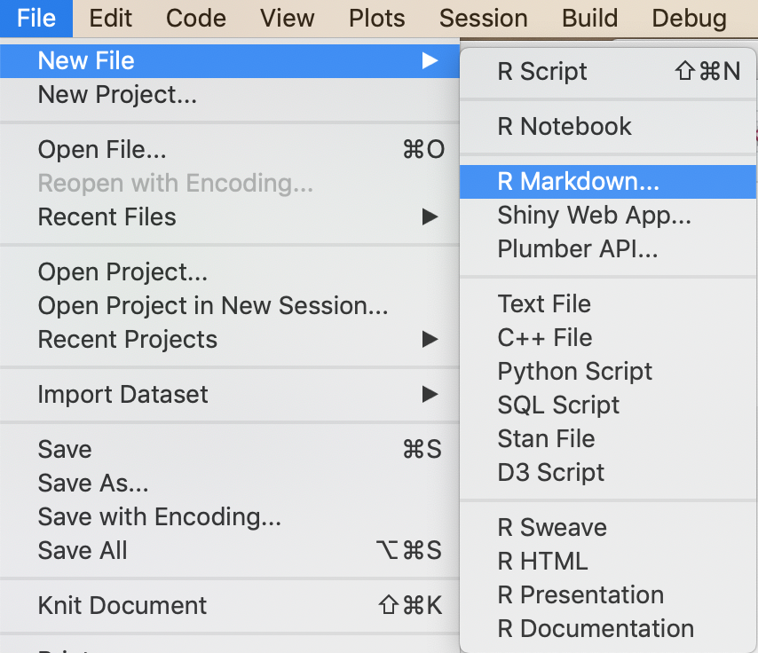

```{r setup, include=FALSE}
knitr::opts_chunk$set(
  echo = TRUE
  )
```

## R Markdown Big Ideas

1. We want to create many **kinds of documents** (websites, books, articles, reports, slides)
in many **file formats** (HTML, PDF, Word, Powerpoint, etc.)

2. We want to include both **text** that we write **and things that are computed**.

3. **Copy-and-paste is not a workflow**

    * hard to document
    * error-prone
    * doesn't scale
    * not reproducible

4. It would be nice if all of this was **easy**.

## R Markdown Workflow

```{r, echo = FALSE, fig.align = "center"}

```

## 3 Parts of an R Markdown Document

1. **YAML header** contains information about document as a whole (title, type of output, etc.)

2. **Text chunks** contain text

    * Can include markdown markup for bold, italics, sectioning, etc.
    * Can include LateX-like mathematics: 
    `$\sqrt{\alpha}$` $\rightarrow$ $\sqrt{\alpha}$
    * Can also include values computed in R

3. **Code chunks** contain code

    * Can separately choose whether to display 
    code itself, output code generates, and/or plots code generates
        

## Creating a new file

### File > New File > R Markdown

```{r, echo = FALSE, fig.align = "center"}

```

## What do you want to create?

For now select **document**, provide a **title** and **author**, and click **OK**.

<div class="columns-2">
```{r, echo = FALSE, fig.align = "center", out.width = 400}
knitr::include_graphics("images/rmarkdown-landing.png")
```

<br>
<br>

* **Presentations** is for slide presentations (like these)
* **From template** lets you start with a template document provided in a pacakge.
    * `rticles` has templates for a number of journals
    * `learnr` has a template for learnr tutorials
    * You can create templates for your students and put them into packages
    
</div>

## YAML Header -- Edit with care

This section is prepolated when you create the document (and sometimes edited
by actions you take later).

You can edit this manually, but it must parse correctly, so be careful.

YAML header starts and ends with `---`

<div class = "columns-2">

```
---
title: "Untitled"
author: "R Pruim"
date: "July 2019"
output: html_document
---
```

<br>
<br>
<br>

```
---
title: "Getting Started with R Markdown"
author: "R Pruim"
date: "July 2019"
output: 
  ioslides_presentation:
    widescreen: true
---
```

</div>

## Text Chunks

Markdown provides lightweight means for adding style to your document.

* `#`, `##`, `###`, etc give different level headers
* `**bold**` $\rightarrow$ **bold**
* `*italics*` $\rightarrow$ *italics*
* links: `[text](http://url.com)`  $\rightarrow$ [text](http://url.com)
* blank line = paragraph break

See [R Markdown Cheatsheet](https://www.rstudio.com/wp-content/uploads/2015/02/rmarkdown-cheatsheet.pdf) for more details.


## Code Chunks and Inline Code


```{r, echo = FALSE, fig.align = "center"}
knitr::include_graphics("images/rmarkdown-rchunks.png")
```

* Insert a chunk with 
* Can use other languages too (Python, C++, bash, SQL, D3, etc.)

## Code Chunk Options

Example: ````{r, echo = FALSE, fig.align = "center"}`
  

```{r, echo = FALSE, fig.align = "center"}

```

More at <https://yihui.name/knitr/>

## Global Chunk Options

If you want different defaults for all of your chunks, you can set those in an R 
chunk like this. (Usually this goes in the "setup" chunk near the top of the document.)

```{r}
knitr::opts_chunk$set(
  echo = TRUE,      # show the R code
  size = "small",   # slightly smaller font
  fig.width = 5,    # width of figures (in inches)
  fig.height = 2.5  # height of figures (in inches)
  )
```


## Important Things to Remember

1. R Markdown documents must be **self-contained**. 

    Each time they are rendered, they start from a fresh R session.

    * must load any packages you use
    * must load any data you use
    * no access to the console or working environment
    
    This is a **good** thing -- else your work would not be reproducible.
    
2. When creating a document, you can run individual chunks (or even just lines of code),
but these are run in your current environment.  This is good for testing, but see #1.


## Your Turn

1. Create a new R Markdown document.  Feel free to start from a template or to create
a presentation.

2. Add some text.  Include some **bold** and *italics* and some section headers.

3. Include a plot. Use `fig.width` and `fig.height` to size it appropriately.

4. Use chunk options to hide the code but reveal the plot.

5. Try anything else that interests you. 

    a. [include an image](https://www.earthdatascience.org/courses/earth-analytics/document-your-science/add-images-to-rmarkdown-report/).
    b. [embed a video](https://bookdown.org/yihui/rmarkdown/learnr-videos.html)
    c. include citations and bibliography -- 
    [this](https://bookdown.org/yihui/rmarkdown/markdown-syntax.html#inline-formatting)
    or [this](https://rmarkdown.rstudio.com/authoring_bibliographies_and_citations.html)
    might be helpful


Explore <https://bookdown.org/yihui/rmarkdown/> for more things you can do with
R Markdown.