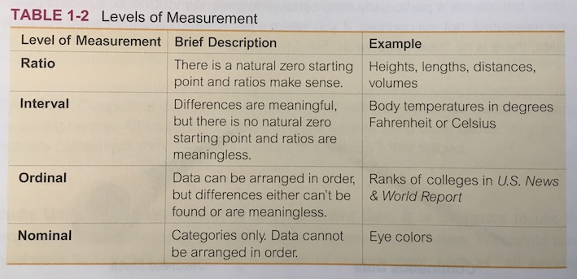

<style>
td,th {
  padding: 5px;
}

</style>

```{r setup, include = FALSE}
library(dplyr)
library(tidyr)
library(printr)
library(kableExtra)

fail <- function(x) {
    glue::glue("[*fail*](/blog/fail/#{x})")
}
```

## GAISE 2016

### [Guidelines for Assessment and Instruction in Statistics Education](https://www.amstat.org/asa/education/Guidelines-for-Assessment-and-Instruction-in-Statistics-Education-Reports.aspx)

1. Teach statistical thinking.
    * Teach statistics as an **investigative process** of problem-solving and 
    **decision-making**.
    * Give students experience with **multivariable thinking**.
    
2. Focus on conceptual understanding.

3. Integrate **real data** with a **context** and **purpose**.

4. Foster **active learning**.

5. Use **technology** to explore concepts and analyze data.

6. Use **assessments** to improve and evaluate student learning.

## Real data a la StatPREP

*See [StatPREP newsletter](http://statprep.org/wp-content/uploads/2019/02/Spring-Newsletter-02.11.19.pdf) for lengthier discussion*

* **captured in the wild**: not collected for teaching statistics
* **appropriate for investigation** of a particular question or set of questions
* **large** enough (think: $n \ge 1000$)
* **rich** enough (think: 5 or more variables)

Working with this sort of data can hone good data skills

* requires organization and automation
* encourages multivariable thinking
* good tools will scale to much larger, richer data sets

These same skills will work for simpler data sets as well, of course.

## Data organization

* Organizing data properly is critically important for ...
    - **thinking** correctly with data
    - using real data with **technology**
    
* Textbooks often do bad things with data
    - optimized for printing on a page
    - trains people to think about data in bad ways

* Excel users often abuse Excel's flexibility
    - optimized for "seeing" the data and for manual entry
    - makes data hard to work with for analysis
    - trains people to think about data in bad ways
    
## Unruly data
 
**unruly**: (adj.) disorderly and disruptive and not amenable to discipline or control

### Some Examples 


## Rules tame unruliness 

1. Always in a "**spreadsheet**" (ie, rows and columns) `r fail("no-spreadsheet")` ︎
2. **Rows**: One row per unit of observation/analysis
    - No summaries in data︎
    - No other info, e.g. codebook, in spreadsheet `r fail("no-annotations")`
    - Any subset of rows is a valid data set.
3. **Columns**: One column per variable `r fail("no-columns")` 
    - Always use column names `r fail("no-column-names")` 
4. Always codebook `r fail("no-codebook")`
    - Rows: how cases were selected
    - Columns: units, specific questions/protocols/methods
5. Segregate data collection and data analysis 
    - Never change the original data as part of the analysis
    
*Note: This sort of tidy/rectangular data is not the only kind of data, but it is an extremely important kind of data and sufficient for introductory courses.*

## Operations on Tidy Data

Advantage of tidy data: it is ammenable to 
**standard, reusable data operations**.


## Operations on Tidy Data

Advantage of tidy data: it is ammenable to 
**standard, reusable data operations**.

### Fundamental Operations

- **summarize** / **reduce**: convert entire data set to 1-row of summary values
    - in spreadsheet: often not tidy, summary formulas can be placed in untidy places
    - in R: `summarise()`; `df_stats()`, etc.
- **mutate** / **transform**: add new variable
    - in spreadsheet: add a new column
    - in R: `mutate()`
- **filter**: remove/ignore rows or columns
    - in spreadsheet: ["hide" data](https://support.google.com/docs/answer/3540681)
    - in R: `filter()`

## Operations on Tidy Data

Advantage of tidy data: it is ammenable to 
**standard, reusable data operations**.

### Superficial Operations

- **select**: remove/ignore columns
    - in spreadsheet: ["hide" data](https://support.google.com/docs/answer/3540681)
    - in R: `select()` 
- **arrange**
    - in spreadsheet, "sort". But how do you do this without altering the data?
    - in R: `arrange()`

## Operations on Tidy Data

Advantage of tidy data: it is ammenable to 
**standard, reusable data operations**.

### Profound Operations

- **group**: handle summarize and mutate in a groupwise way
    - in spreadsheet: [pivot table](https://support.google.com/docs/answer/1272900)
    - in R: `group_by()`; formulas (eg, `blood_pressure ~ age + sex`)
- **join**: bring together data from multiple sources
    - in spreadsheet ["fusion tables"](https://support.google.com/fusiontables/answer/171254?hl=en) but will be [phased out in Dec. 2019 in terms of SQL operations](https://support.google.com/fusiontables/answer/9185417)
- **spread** / **gather**: change unit of analysis
    - in spreadsheet [pivot/unpivot](https://eagereyes.org/basics/spreadsheet-thinking-vs-database-thinking) 
    - in R:  `pivot_wider()`, `pivot_longer()` [formerly `spread()`, `gather()`]

## Shape: Long vs Wide Data {.smaller}

Need to be able to move between these two formats.

**Long**

```{r wide, echo = FALSE, message = FALSE}
gapminder::gapminder %>% 
    select(country, continent, year, lifeExp) %>%
    head(6) %>%
    kable() %>%
    kable_styling(bootstrap_options = c("striped", "hover", "responsive")) 
```

**Wide**

```{r long, echo = FALSE}
gapminder::gapminder %>% 
    select(country, continent, year, lifeExp) %>%
    mutate(year = paste0("pop", year)) %>% 
    pivot_wider(names_from = "year", values_from = "lifeExp") %>%
    head(4) %>% 
    kable() %>%
    kable_styling(bootstrap_options = c("striped", "hover", "responsive")) 
```


## Quiz


List the many ways in which this "table" violates the conventions for effective data organization.

<!-- ## Variable types -->

<!-- These are often introduced as definitions before the student has any use for them.  -->

<!-- In stats book:  -->

<!--  -->

<!-- Key distinction / minor distinctions -->

<!-- - **numerical/quantitative**: interval, ratio, count, measure,  ... -->
<!-- - **categorical**: unordered, ordered -->


## Taxonomy of Variable Types 

1. Numerical 

    * **quantities** (with **dimension** and **units**) --
    * **times** and **dates**
    * **counts** (natural numbers)
    * ~~codes represent discrete levels, not really numerical~~
    
2. Categorical 
    * Note: "Two-sample" isn't (usually) two samples
        * one sample, two **variables**
        * categorical variable identifies the group
    * Summarizing with proportions doesn't make categrical data numerical
    * Can be ordered or unordered
    
    <!-- a. fixed vs "random"  -->
    <!--     * Fixed: data contains all levels of interest -->
    <!--     * Random: data represents a subset of/sample from levels of interest -->

<!-- ### Operations on variables -->

<!-- Some operations only make sense for certain types of variables -->

<!-- - sum / mean -->
<!--     - helps distinguish numerical codes from true numerical variables -->
<!--     - is sum meaningful? e.g. miles per gallon versus gallons per mile -->

<!-- ### Transformation variables -->

<!-- - ratio (only with natural origin): but how often are we doing ratio transformations in stats class? -->
<!-- - difference () -->
<!-- - sqrt, log, ... (only with natural origin) -->


## Taxonomy of Variable Roles 

1. Explanatory

    * a.k.a predictor, regressor, input, feature, ~~independent~~

2. Response

    * a.k.a. predicted, ~~dependent~~
    
**Key question:** How does the response depend on the explanatory variable(s)?